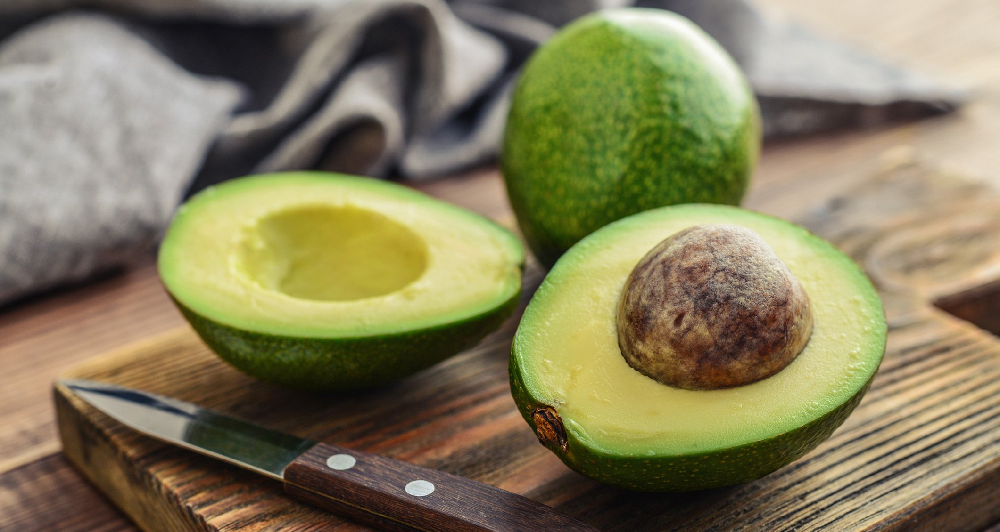

<style>                     
.navbar {
  background-color:lightgreen;
  border-color:#7F8534;
      border: 5px solid #4CAF50;
}

.navbar-brand {
  color:#847718!important;
    font-size: 30px;
  font-weight:bold;
}

</style>

```{r setup, include=FALSE}
library(flexdashboard)
pacman::p_load(tidyverse,ggplot2,lubridate,tibbletime,ggthemes,highcharter,RColorBrewer,tibble,patchwork,ggridges)


library(tidyverse)
library(ggplot2)
library(skimr)
library(GGally)
library(tibbletime)
library(pander)
library(readr)
library(lubridate)
library(USAboundaries)
library(buildings)
library(leaflet)
library(skimr)
library(GGally)
library(geofacet)
library(scales)
library(sf)
library(digest)
library(mosaic)
library(DT)
library(ggrepel)
#FOR GGSEASONPLOT
library(fpp2)
#animate
library(gganimate)
library(dplyr)
library(gapminder)
install.packages("ggthemes-master.zip", repos = NULL, type="source")
library(ggthemes)
#csv files
avocado <- read.csv("../Avocado/avocado.csv")

city <- read.csv("../Avocado/city.csv")
#Long and lat for region
longlat <- read.csv("../Avocado/statelongnlat.csv")
#state file in geometry
states <- USAboundaries::us_states()

#making new column as total and addig all the value to make total for each state abbr
state_totals <- permits%>%
  group_by(StateAbbr)%>%
  summarize(total = sum(value))

#state totals
state_map <- states%>%
  left_join(state_totals, by = c("state_abbr"="StateAbbr"))


                          


# changing the year/month/day
#avocado$Date <- lubridate::as_date(avocado$Date, "%Y-%m-%d")
avocado$Date <- as.Date(avocado$Date, "%Y-%m-%d")

#class(avocado$Date)
# Sort the dates
avocado1 <- avocado[order(as.Date(avocado$Date, format="%Y-%m-%d")),]
```

### <font size = "6"><b>Background</b></font>





***

**Hass Avocado:**

***

The Hass avocado is a cultivar of avocado with dark green–colored, bumpy skin. It was first grown and sold in Southern California 

The Hass avocado is a large-sized fruit weighing 200 to 300 grams. When ripe, the skin becomes a dark purplish-black and yields to gentle pressure. When ready to serve, it becomes white-green in the middle part of the inner fruit.

Owing to its taste, size, shelf-life, high growing yield and in some areas, year-round harvesting, the Hass cultivar is the most commercially popular avocado worldwide. In the United States it accounts for more than 80% of the avocado crop, 95% of the California crop and is the most widely grown avocado in New Zealand.
<br/>
<br/>

**Business Questions:**

* What is the price difference between conventional & organic avocados?

* When is the best time of the month to sell Hass avocados?

* When is a good season to buy Hass avocados?

* When will be the best time for farmers to buy & sell Hass avocados?

* Where are the most expensive locations & Cheapest to buy Hass avcados?

* Was the Avocadopocalypse of 2017 real?
<br/>


**Suggested Analyses:**

* Sale trends for the fresh avocado category
* Private sale trends
* Competition sale trends
* Size of the price of Hass avocados
<br/></br>


### <font size = "5"><b>Variable Description</b></font>

```{r}
datatable(head(avocado,100), options = list(
  initComplete = JS(
    "function(settings, json) {",
    "$(this.api().table().header()).css({'background-color': 'lightgreen', 'color': 'brown'});",
    "}")
))

```

***
**Variable Description:** (I only brought 100 entries as a sample instead of 18,249 entries) This is the original data given from 'hassavocadoboard.com'

***

* Date - YYY/MM/DD
* AveragePrice- US dollars
* Total.Volume- sum of X4046+X4225 +X4770 + Total.bags = Total. Volume
* X4046-Small/Medium Hass Avocado (~3-5oz avocado) #4046(Hass Avocado Bags | Size varies)
* X4225-Large Hass Avocado (~8-10oz avocado) | #4225
* X4770-Extra Large Hass Avocado (~10-15oz avocado) | #4770
* Total.Bags- Small.Bags + Large.Bags = Total.Bags
* Small.Bags- Prices Sold
* Large.Bags- Prices Sold
* XLarge.Bags-Prices Sold
* Type - Coventional or Organic
* year- year
* region - City


```{r}
#creates state_name column from avocado 
avocado$state_name<-avocado$region

###UNKNOWN###
#
#changing city to state
#"GreatLakes"
#"HartfordSpringfield"
#"Midsouth"  -not a city
#"NewYork"           
#"Northeast"          -not a city
#"NorthernNewEngland" -not a city
#"PhoenixTucson"      
#"Plains"-not a city             
#"RaleighGreensboro"- has noth and south
#"RichmondNorfolk"-richmond & norfolk is both virginia 
#"SouthCentral"  not a state or city
#"Southeast"  not a state or city
#"TotalUS" 
#"West"                #WestTexNewMexico"
#
#
#


###changing region to each state
avocado$state_name <- gsub("Albany", "New York", avocado$state_name )
avocado$state_name <- gsub("Atlanta", "Georgia", avocado$state_name )
avocado$state_name <- gsub("BaltimoreWashington", "Maryland", avocado$state_name )
avocado$state_name <- gsub("Boise", "Idaho", avocado$state_name )
avocado$state_name <- gsub("BuffaloRochester", "New York", avocado$state_name )
avocado$state_name <- gsub("Rochester", "New York", avocado$state_name )
avocado$state_name <- gsub("Charlotte", "North Carolina", avocado$state_name )
avocado$state_name <- gsub("Chicago", "Illinois", avocado$state_name )
avocado$state_name <- gsub("CincinnatiDayton", "Ohio", avocado$state_name )
avocado$state_name <- gsub("Dayton", "Ohio", avocado$state_name )
avocado$state_name <- gsub("Columbus", "Ohio", avocado$state_name )
avocado$state_name <- gsub("DallasFtWorth", "Texas", avocado$state_name )
avocado$state_name <- gsub("Denver", "Colorado", avocado$state_name )
avocado$state_name <- gsub("Detroit", "Michigan", avocado$state_name )
avocado$state_name <- gsub("GrandRapids", "Michigan", avocado$state_name )
avocado$state_name <- gsub("HarrisburgScranton", "Pennsylvania", avocado$state_name )
avocado$state_name <- gsub("Scranton", "Pennsylvania", avocado$state_name )
avocado$state_name <- gsub("Hartford", "Connecticut", avocado$state_name )
avocado$state_name <- gsub("Springfield", "Illinois", avocado$state_name )
avocado$state_name <- gsub("Houston", "Texas", avocado$state_name )
avocado$state_name <- gsub("Indianapolis", "Indiana", avocado$state_name )
avocado$state_name <- gsub("Jacksonville", "Missouri", avocado$state_name )
avocado$state_name <- gsub("LasVegas", "Nevada", avocado$state_name )
avocado$state_name <- gsub("LosAngeles", "California", avocado$state_name )
avocado$state_name <- gsub("Louisville", "Kentucky", avocado$state_name )
avocado$state_name <- gsub("MiamiFtLauderdale", "Florida", avocado$state_name )
avocado$state_name <- gsub("Nashville", "Tennessee", avocado$state_name )
avocado$state_name <- gsub("NewOrleansMobile", "Louisiana", avocado$state_name )
avocado$state_name <- gsub("Orlando", "Florida", avocado$state_name )
avocado$state_name <- gsub("Philadelphia", "Pennsylvania", avocado$state_name )
avocado$state_name <- gsub("PhoenixTucson", "Arizona", avocado$state_name )
avocado$state_name <- gsub("Pittsburgh", "Pennsylvania", avocado$state_name )
avocado$state_name <- gsub("Portland", "Oregon", avocado$state_name )
avocado$state_name <- gsub("RaleighGreensboro", "Carolina", avocado$state_name )
avocado$state_name <- gsub("RichmondNorfolk", "Virginia", avocado$state_name )
avocado$state_name <- gsub("Roanoke", "Virginia", avocado$state_name )
avocado$state_name <- gsub("Sacramento", "Virginia", avocado$state_name )
avocado$state_name <- gsub("SanDiego", "California", avocado$state_name )
avocado$state_name <- gsub("SanFrancisco", "California", avocado$state_name )
avocado$state_name <- gsub("Seattle", "Washington", avocado$state_name )
avocado$state_name <- gsub("SouthCarolina", "South Carolina", avocado$state_name )
avocado$state_name <- gsub("Spokane", " Washington", avocado$state_name )
avocado$state_name <- gsub("StLouis", "Missouri", avocado$state_name )
avocado$state_name <- gsub("Syracuse", "New York", avocado$state_name )
avocado$state_name <- gsub("Tampa", "Florida", avocado$state_name )

#combining avocado and lonlat csv file together for state_name.
avocado_city <- avocado %>% 
  left_join(longlat, by = c("state_name"="state_name"))
```

```{r,fig.width = 18,fig.height= 6}

# Filter by type for organic
organic <- avocado %>% 
  select(Date, AveragePrice, type, Total.Volume) %>% 
  filter(type == "organic")

# Filter by type for conventional
conventional <- avocado %>% 
  select(Date, AveragePrice, type, Total.Volume) %>% 
  filter(type == "conventional")


# Organic avocado


FANG1 <- as_tbl_time(organic, Date)

FANG1 <- dplyr::group_by(FANG1, Date)

organic <- as_period(FANG1, '1 month')


organic <- as_tbl_time(organic, index=Date)
organic <- as_period(organic, '1 month')


# conventional avocado


FANG <- as_tbl_time(conventional, Date)

FANG <- dplyr::group_by(FANG, Date)

conventional <- as_period(FANG, '1 month')


avocado2 <- avocado

avocado2$month_year <- format(as.Date(avocado$Date), "%Y-%m")
avocado2$month <- format(as.Date(avocado$Date), "%m")
avocado2$year <- format(as.Date(avocado$Date), "%Y")


avocado2$monthabb <- sapply(avocado2$month, function(x) month.abb[as.numeric(x)])
avocado2$monthabb = factor(avocado2$monthabb, levels = month.abb)

```


```{r,results='hide'}

# this is when I wanted to use the long and lat but didnt work
datatable(head(avocado_city[,c(14,15,16,17,18,1,2,3,4,5,6,7,8,9,10,11,12,13)],100), options = list(searchHighlight = TRUE,
  initComplete = JS(
    "function(settings, json) {",
    "$(this.api().table().header()).css({'background-color': 'lightgreen', 'color': 'brown'});",
    "}")
)) %>% 
  formatStyle(
    c("ï..state",'state_name','Latitude','Longitude'),
    backgroundColor = 'yellow'
  )

```


### <font size = "4"><b>Price difference of Conventional & Organic Avocados</b></font>

####**Popularity being sold by density**  {.tabset .tabset-fade .tabset-pills}


```{r,fig.width = 18,fig.height= 6}

#this shows me graph of conventional and organic
ggplot(avocado, aes(x=AveragePrice, fill=type)) + 
  geom_density() + 
  #splits to two groups
 # facet_wrap(~type) + 
  #This makes the boxes at the back
  theme_minimal()  + 
  #this is my theme for graph color
  scale_fill_brewer(palette="Set4")+
  #this makes my title name 
  #avocado background
  theme(plot.title=element_text(hjust=0.5),
  plot.background=element_rect(fill="#B5C259"))
```

####**Prices for Avocado in Average** 
***
```{r,fig.width = 18,fig.height= 6}
ggplot(avocado, aes(x=type, y=AveragePrice)) + 
  geom_boxplot(col=c("#6F7EB3","#D05B5B")) + 
  #splits to two groups
 # facet_wrap(~type) + 
  #This makes the boxes at the back
  theme_minimal() + 
  #this is my theme for graph color
  #this makes my title name 
  #avocado background
  theme(plot.title=element_text(hjust=0.5),
  plot.background=element_rect(fill="#B5C259"))

```


***
**Summary:**

---

**Organic:**
More expensive than conventional but is less popular than conventional.
<br/>

**Conventional:**
Cheaper than organic and has more popular than organic.
<br/>


###  <font size = "4"><b>Average price vs Total volume</b></font>

####**Popularity of Total Volume being sold by Price** 
***
```{r,fig.width = 18,fig.height= 6}
## making key more compact
xyplot(AveragePrice ~ Total.Volume, avocado2,
       grid = TRUE,
       scales = list(x = list(log = 10, equispaced.log = FALSE)),
       group = type, auto.key = list(columns = nlevels(avocado2$type)),
       type = c("p", "smooth"), lwd = 4)


```


####**opularity of Total Volume being sold by Price** 
***
```{r,fig.width = 18,fig.height= 6}


xyplot(AveragePrice ~ Total.Volume, avocado2,
       grid = TRUE,
       scales = list(x = list(log = 10, equispaced.log = FALSE)),
       group = type, auto.key = TRUE,
       type = c("t", "smooth"), lwd = 4, color=c("red","blue"))
```

***
**Summary:**

---
Cleary the Price goes down if the total Volume is higher. So seems like avocados buyers like to purchase them around  10,000 total volume for organic wise, but since conventional is cheaper, they buy it around 16,000 total volume.

###<font size = "4"><b> Yearly changes for both Price avocados</b></font>
```{r,fig.width = 18,fig.height= 6}

ggplot(conventional,aes(x=Date, y=AveragePrice)) + geom_line(color="black") + theme_economist() + 
theme(plot.title=element_text(hjust=0.5), plot.background=element_rect(fill="#B5C259")) + 
labs(title="Conventional Avocados") + geom_hline(yintercept=max(conventional$AveragePrice), linetype="dashed", color = "green") + 
geom_hline(yintercept=min(conventional$AveragePrice), linetype="dashed", color = "red")


ggplot(conventional,aes(x=Date, y=Total.Volume)) + geom_bar(stat='identity', fill="brown", color="black") + theme_economist() + 
theme(plot.title=element_text(hjust=0.5), plot.background=element_rect(fill="#B5C259")) + 
geom_smooth(method="loess", color="green")+
labs(title="Conventional Avocados for Total Volume") 


ggplot(organic,aes(x=Date, y=AveragePrice)) + geom_line(color="black") + theme_economist() + 
theme(plot.title=element_text(hjust=0.5), plot.background=element_rect(fill="#B5C259")) + 
labs(title="Organic Avocados") + geom_hline(yintercept=max(organic$AveragePrice), linetype="dashed", color = "green") + 
geom_hline(yintercept=min(organic$AveragePrice), linetype="dashed", color = "red")


ggplot(organic,aes(x=Date, y=Total.Volume)) + geom_bar(stat='identity', fill="brown", color="black") + theme_economist() + 
theme(plot.title=element_text(hjust=0.5), plot.background=element_rect(fill="#B5C259")) + 
geom_smooth(method="loess", color="green")+
labs(title="Organic Avocados for Total Volume") 
```


```{r,fig.width = 18,fig.height= 6}

g <- ggplot(avocado2, aes(x=Date,y=AveragePrice,color=year))

# Scatterplot
g + geom_point() + 
  geom_smooth(method="lm", se=F) +
  labs(subtitle="Jitterplot", 
       y="Date", 
       x="AveragePrice", 
       title="Jitter plot for both Avocados", 
       caption="by:Woo")
```


***
**Summary:**

---

Conventional: Total volume purchase increases every year 
<br/>
Organic:Total volume purchase increases every year 


### <font size = "4"><b>Seasonal patterns yearly comparison </b></font>


####**Popularity of Avocado by year** 

```{r,fig.width = 18,fig.height= 6}

ggplot(
  avocado2, 
  aes(x = AveragePrice, y = as.factor(year))
  ) +
  geom_density_ridges_gradient(
    aes(fill = ..x..), scale = 3, size = 0.3
    ) +
  scale_fill_gradientn(
    colours = c("green", "yellow", "red"),
    name = "Average Price"
    )+
  labs(title = 'Popularity of Avocado by year',x = 'Average Price', y = 'year') +
  theme(plot.title=element_text(hjust=0.5),
  plot.background=element_rect(fill="#B5C259"))


```

####**Popularity of Avocado by year Combined** 
***

```{r,fig.width = 18,fig.height= 6}
#together
ggplot(avocado2, aes(x = AveragePrice, fill = as.factor(year))) + 
  geom_density(alpha = .5) + 
  theme_economist() +
  #avocado background theme
  theme(plot.title=element_text(hjust=0.5),
  plot.background=element_rect(fill="#B5C259")) +
  #title
  labs(title="Popularity of Avocado by year Combined", x = 'Average Price', y = 'Density') + 
  #changing color
scale_fill_manual(values=c("blue", "red", "purple", "yellow"))


```


***
Through this graph, we were able to determine that 2015 was the best year for selling most avocados, but 2018 had a higher price and still had a high selling density just like 2015. Suprisingly, the avocado's density for 2016 and 2017 was less than 1.


### <font size = "4"><b>Monthly Comparison for Conventional & Organic Avocados</b></font>

```{r,fig.width = 18,fig.height= 6}
#checking with monthly pattern
  conventional_organic <- avocado2 %>% 
  select(monthabb, AveragePrice, type) %>% 
  filter(type == "conventional") %>%
  group_by(monthabb) %>% 
  summarize(avg=mean(AveragePrice))


organic_month <- avocado2 %>% 
  select(monthabb, AveragePrice, type) %>% 
  filter(type == "organic") %>%
  group_by(monthabb) %>% 
  summarize(avg=mean(AveragePrice))
```

####**Conventional Avocados Sold per Month** 

```{r,fig.width = 18,fig.height= 6}
  #for my x and y variable in graph
ggplot(data=conventional_organic,aes(x=monthabb, y=avg)) + 
  #color for my geom_point with size
  geom_point(color="skyblue", aes(size=0.5)) +
  #putting names next to geom_point
  geom_text(aes(label=monthabb),hjust=0, vjust=0)+
  #color for geom)line
  geom_line(group=2, color="brown") + 
  #shows the line for 1.1, 1.2, 1.3 as a white line
  theme_economist() + 
  #background change
  theme(legend.position="none", plot.title=element_text(hjust=0.5), plot.background=element_rect(fill="#B5C259")) + 
  #changing names for title, x, y
  labs(title="Conventional Avocados Sold by Month", x="Month", y="Average Price")


```

####**Organic Avocados Sold per Month** 
***

```{r,fig.width = 18,fig.height= 6}  
  #for my x and y variable in graph
ggplot(data=organic_month,aes(x=monthabb, y=avg)) + 
  #color for my geom_point with size
  geom_point(color="skyblue", aes(size=0.5)) +
  #putting names next to geom_point
  geom_text(aes(label=monthabb),hjust=0, vjust=0)+
  #color for geom)line
  geom_line(group=2, color="brown") + 
  #shows the line for 1.1, 1.2, 1.3 as a white line
  theme_economist() + 
  #background change
  theme(legend.position="none", plot.title=element_text(hjust=0.5), plot.background=element_rect(fill="#B5C259")) + 
  #changing names for title, x, y
  labs(title="Organic Avocados Sold per Month", x="Month", y="Average Price")  

```


####**Comparing Average Price Yearly for Conventional & Organic** 

```{r,fig.width = 18,fig.height= 6}
require(plyr)
seasonal4avocado<-ddply(avocado2,.(type,year,monthabb),summarise,AveragePrice=mean(AveragePrice))

  ggplot(seasonal4avocado,aes(x=monthabb, y=AveragePrice,group=type))+
    geom_point(colour= "pink")+
    geom_line(aes(colour = type))+
    geom_text_repel(data=seasonal4avocado,aes(x=monthabb,y=AveragePrice,label=paste0("$ ", round(AveragePrice,2))),hjust=-0.0, vjust=-2.5, size=3, 
            colour="black", fontface="bold",angle=30)+
    scale_color_manual(values = c("dodgerblue2", "red"))+
    facet_wrap(~as.factor(year))+
    theme_minimal()+
  theme(plot.title=element_text(hjust=0.5), plot.background=element_rect(fill="#B5C259"), axis.text.x = element_text(angle = 90)) + 
  labs(title="Comparing Average Price Yearly for Conventional & Organic", x="Month", y="Average Price")


```

***
**Conventional:** 

***
Cheapest month to buy avocados would be in Feburary. Conventional avacados are the most expensive in October, but notice how quickly the price goes down after.


***
**Organic:**

***
Cheapest month to buy organic avocados would be in Feburary. Organic avacados are the most expensive earlier in September, and notice also the drops after september.


### <font size = "5"><b>Regional average price for Avocados</b></font>


####**Total price mostly purchased Region for coventional Avocado** 

```{r,fig.width = 18,fig.height= 6}

#reordered the boxplot, my x and y variable
ggplot(avocado2,aes(x=reorder(region, AveragePrice,FUN=mean),y=AveragePrice))+
  #boxplot
  geom_bar(stat="identity")+
  #flip the x axis to y axis
  coord_flip()+
  #title
  labs(title="Total price mostly purchased Region for coventional Avocado", x="Region", y="Total Price Sold")+
  #background theme
  theme(legend.position="none", plot.title=element_text(hjust=0.5),
        plot.background=element_rect(fill="#B5C259"))+
  #x intercept fonts
  theme(axis.text.x = element_text(angle = 0, hjust = 1,size=15))+
  #y intercept fonts
  theme(axis.text.y = element_text(angle = 0, hjust = 1,size=9))
#+
 # ylim(NA, 2)

```


####**Total price mostly purchased Region for Organic Avocado** 
***

```{r,fig.width = 18,fig.height= 6}
#reordered the boxplot, my x and y variable
ggplot(avocado2,aes(x=reorder(region, AveragePrice, FUN = mean),y=AveragePrice))+
  #boxplot
  geom_bar(stat="identity")+
  #flip the x axis to y axis
  coord_flip()+
  #title
  labs(title="Total price mostly purchased Region for Organic Avocado", x="Region", y="Total Price Sold")+
  #background theme
  theme(legend.position="none", plot.title=element_text(hjust=0.5),
        plot.background=element_rect(fill="#B5C259"))+
  #x intercept fonts
  theme(axis.text.x = element_text(angle = 0, hjust = 1,size=15))+
  #y intercept fonts
  theme(axis.text.y = element_text(angle = 0, hjust = 1,size=9))

```

***

Now I'm going to compare by Top 10 Highest AveragePrices of Avocados per Region

```{r,fig.width = 18,fig.height= 6}
require(plyr)
top10 <- ddply(avocado2, .(region), summarise, top10 =max(AveragePrice)) %>% top_n(10)


low10 <- ddply(avocado2, .(region), summarise, low10 =min(AveragePrice)) %>% top_n(10)

ggplot(top10,aes(x=reorder(region, top10, FUN = mean), y=top10,fill=region))+
  geom_bar(stat="identity")+
  coord_flip()+
  labs(title="Top 10 Highest AveragePrice of Avocado per Region", x="Region", y="Average Price")+
  #background theme
  theme(legend.position="none", plot.title=element_text(hjust=0.5),
        plot.background=element_rect(fill="#B5C259"))+
  #x intercept fonts
  theme(axis.text.x = element_text(angle = 0, hjust = 1,size=15))+
  #y intercept fonts
  theme(axis.text.y = element_text(angle = 0, hjust = 1,size=9))

ggplot(low10,aes(x=reorder(region, low10, FUN=mean), y=low10,fill=region))+
  geom_bar(stat="identity")+
  coord_flip()+
  labs(title="Top 10 Lowest AveragePrice of Avocado per Region", x="Region", y="Average Price")+
  #background theme
  theme(legend.position="none", plot.title=element_text(hjust=0.5),
        plot.background=element_rect(fill="#B5C259"))+
  #x intercept fonts
  theme(axis.text.x = element_text(angle = 0, hjust = 1,size=15))+
  #y intercept fonts
  theme(axis.text.y = element_text(angle = 0, hjust = 1,size=9))
```

***
Ranks highest to lowestAverage price mostly purchased Region for coventional/organic Avocado
<br/>
<br/>

* 1.Hartford, Springfield
* 2.San Fransico
* 3.NewYork
* 4.Philadelphia
* 5.Sacramento
<br/>
<br/>
Top 10 Highest AveragePrice of Avocado per Region
<br/>
<br/>
Notice how Hartfort and Springfield have sold the most avocados, bu they sell the avodacos for a really cheap price.


### <font size = "4"><b>Seasonal change per year for both Avocados</b></font>

```{r,fig.width = 18,fig.height= 6}
options(repr.plot.width=8, repr.plot.height=6) 
avocado2$season <- ifelse(avocado2$month %in% c("03","04","05"), "Spring",
                             ifelse(avocado2$month %in% c("06","07","08"), "Summer",
                             ifelse(avocado2$month %in% c("09","10","11"), "Fall", "Winter")))


avocado3<-ddply(avocado2,.(year,season,type),summarise,AveragePrice=mean(AveragePrice))

avocado3$season <- factor(avocado3$season,levels = c("Spring","Summer","Fall","Winter"))

  
ggplot(avocado3,aes(x=season,y= AveragePrice, color=type))+
  geom_point(size=3)+
  facet_wrap(~as.factor(year))+
  theme_minimal()+
  theme(plot.title=element_text(hjust=0.5),plot.background=element_rect(fill="#B5C259")) + 
  scale_color_manual(values=c("dodgerblue2", "red", "orange", "blue")) +
  labs(title="Conventional Avocados by Season", x="Season", y="Average Price") +
  geom_text_repel(data=avocado3, aes(x=season,y=AveragePrice,label=paste0("$ ", round(AveragePrice,2))),hjust=-0.5, vjust=-5.5, size=5, 
            colour="black", fontface="bold",angle=0)


```

***
**Summary:**

---

I have set up spring to reresent March, April, and May. Summer represents June, July, and August, and so on. The most expensive season to buy avocados is in the fall and cheapest season to buy avocados is in the winter.


### <font size = "4"><b>Most Avocados sold for Type/Region</b></font>

```{r,fig.width = 18,fig.height= 6}
avocado2 <- avocado %>% mutate(Item = paste(type,region,sep='/'))

p_total <- ddply(avocado2, .(Item), summarise, Total.Volume= sum(Total.Volume)) %>%  top_n(10)


ggplot(p_total,aes(x=reorder(Item, Total.Volume, FUN =mean),y=Total.Volume,fill=Item))+
  geom_bar(stat="identity")+
  geom_text(data= p_total, aes( x=Item, y=Total.Volume, label=paste0("$ ", comma(Total.Volume,2))),
            size = 3, vjust = 1.5)+
  coord_flip()+
  labs(title="Most Avocados sold for Type/Region",subtitle="By:Woohoo",x="Type/Region",y="Total Volume")+
  # background theme color
  theme(plot.title=element_text(hjust=0.5),
  plot.background=element_rect(fill="#B5C259"))+
   #x intercept fonts
  theme(axis.text.x = element_text(angle = 0, hjust = 1,size=11))+
  #y intercept fonts
  theme(axis.text.y = element_text(angle = 0, hjust = 1,size=8))
```

***

The most avocados are sold in Total US, and the most popular type of avocado is sold is Conventional.

###<font size = "5"><b>State vs Total Price</b></font>
```{r,fig.width = 18,fig.height= 6}

p_total <- ddply(avocado2, .(state_name), summarise, Total.Volume= sum(Total.Volume)) %>%  top_n(10)


ggplot(p_total,aes(x=reorder(state_name,Total.Volume, FUN=mean),y=Total.Volume,fill=state_name))+
  geom_bar(stat="identity")+
  geom_text(data= p_total, aes(x=state_name, y=Total.Volume, label=paste0("$ ", comma(Total.Volume,2))),
            size = 3, vjust = 1.5)+
  coord_flip()+
  labs(title="Most Avocados sold for each State",subtitle="By:Woohoo",x="State",y="Total Price")+
  # background theme color
  theme(plot.title=element_text(hjust=0.5),
  plot.background=element_rect(fill="#B5C259"))+
   #x intercept fonts
  theme(axis.text.x = element_text(angle = 0, hjust = 1,size=11))+
  #y intercept fonts
  theme(axis.text.y = element_text(angle = 0, hjust = 1,size=8))+
  scale_y_continuous(labels = scales::dollar)


```

***
**Summary:**

---

The most avocados are sold in the Total US, and the next highest total avocados sold is in California.


###<font size = "5"><b>Conclusion</b></font>

This is the final analysis we have implemented. These are the findings.

* Organic Avocados are much more expensive than Conventional Avocados.

* There is a similarity of patterns between the avocado types; there are some distinguishable patterns between the two types of the avocados, but we see that most patterns are pretty similar.

* 2017 was the best year for avocado sales, but there can be some hidden factors that would alter the graph.

* In 2017, avocados were sold at the highest prices, and it also has the highest volatility. In addition, the price fluctuations were higher in this year while others didn't fluctuate in the past two years.


* We see the same patterns with the avocado prices increasing when August comes. This applies to both conventioan and organic. But, notice that Conventional was the most expensive in October and Organic was the most expensive in September. 

* This provided insights for avocado farmers & purchasers when to purchase the avocado both conventional and organic.

* This also provides insights for avocado farmers & merchants when to sell the avocado product.

* Avocado Purchasers like to buy organic ,on average, 10,000 total volume, conventional on average 16,000 total volume. People buy conventional avocados more because they're cheaper than organic.

* Avocado sales have been increasing yearly for both conventional and organic.

* The ranks from highest to lowest average & price most purchased region for coventional/organic Avocado was 1.Hartfor/Springfield, 2.San Fransico, 3.New York ,4.Philadelphia, 5.Sacramento 

* Notice how Hartfort and Springfield have sold the most avocados, bu they sell the avodacos for a really cheap price.

* The cheapest season to buy avocados is in Spring, avoid buying them in fall.

* The most avocados are sold in Total us, conventional avocados. Also Notice that conventional avocaods are sold more than organic avocados.


